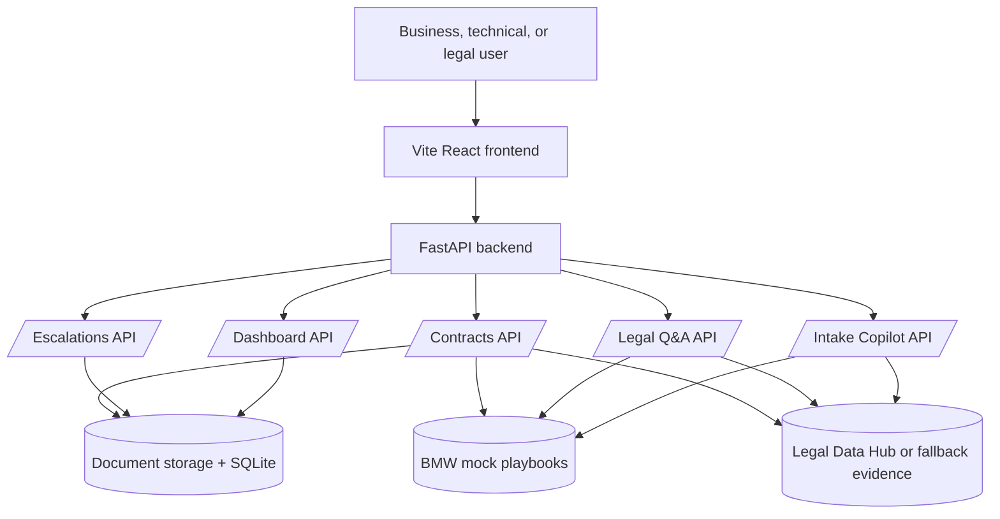
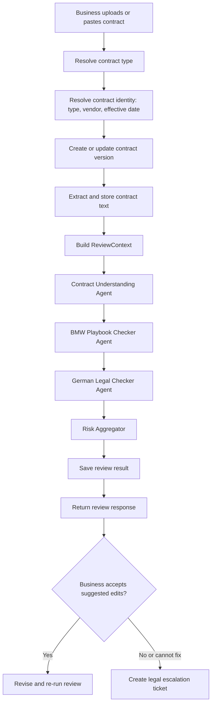
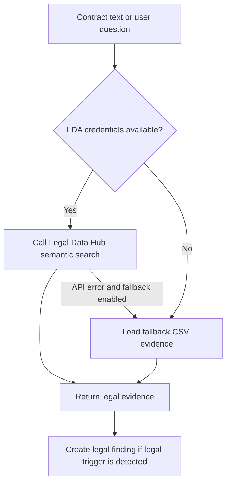
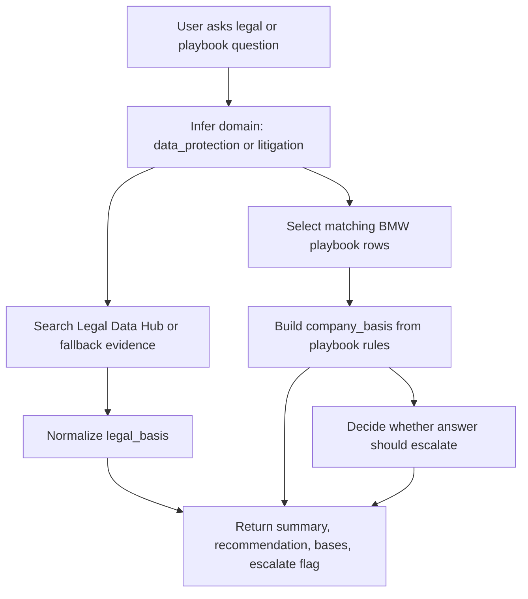
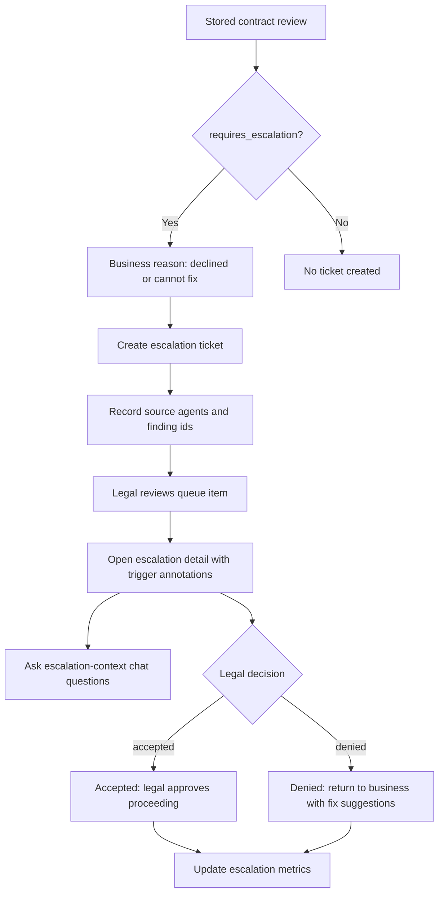
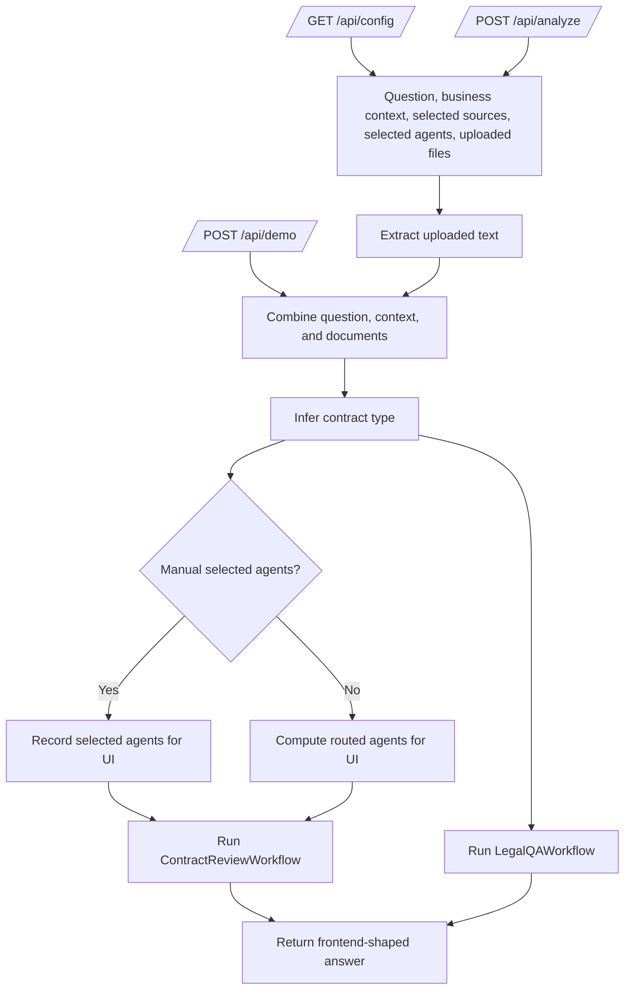
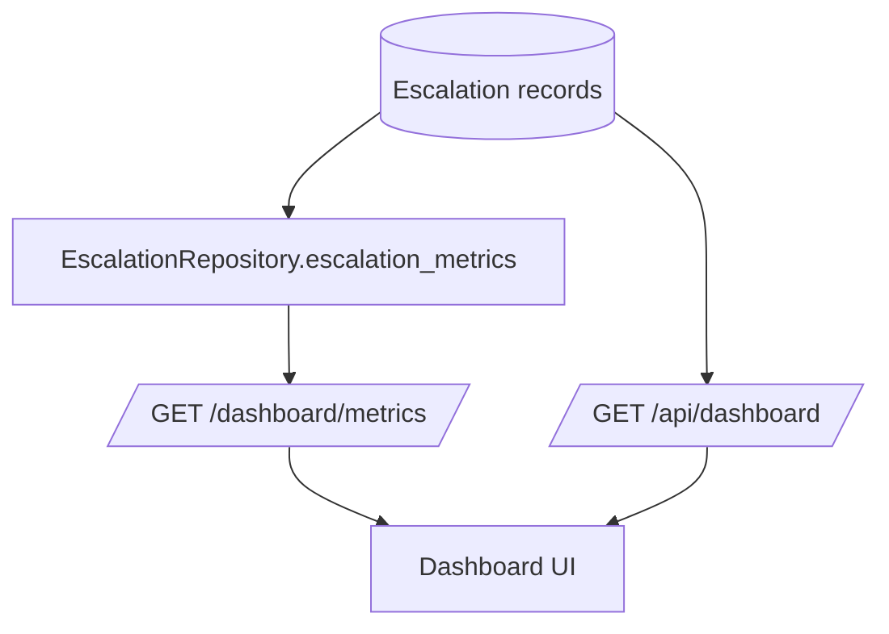
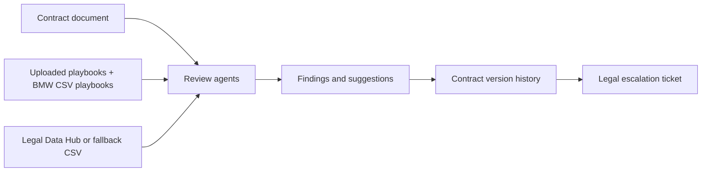

# Harvey Workflow Reference

This document explains the agents and workflows currently implemented in Harvey, a BMW-focused AI contract assistant demo. It is intended as a presentation reference for explaining how contract review, Legal Q&A, escalation, intake, and dashboard workflows fit together.

## System Overview

Harvey is built around a FastAPI backend that receives contract text, uploaded documents, or legal questions, then routes the request through specialist review agents and workflow services.



Core source files:

- `backend/app/agents`: specialist agents and shared agent models.
- `backend/app/workflows`: orchestration for contract review, Legal Q&A, and escalation packaging.
- `backend/app/api`: route modules for browser/backend workflows.
- `backend/app/services`: persistence, document extraction, and Legal Data Hub adapter.
- `data/playbook`: BMW mock playbook CSV and source documents.
- `data/legal_fallback`: fallback legal evidence for demo reliability.

## Shared Agent Contract

All replaceable review agents use the shared models in `backend/app/agents/base.py`.

```mermaid
flowchart LR
    Context[ReviewContext] --> Agent[Agent.run(context)]
    Agent --> Result[AgentResult]
    Result --> Findings[Findings]
    Result --> Suggestions[Suggestions]
    Result --> Confidence[Confidence]
    Result --> Escalation[requires_escalation]
    Findings --> Evidence[Evidence, trigger text, ruling reference]
```

`ReviewContext` carries the contract id, contract text, optional contract type, uploaded playbook documents, user question, and metadata.

`AgentResult` carries the agent name, summary, findings, suggested fixes, confidence, escalation flag, and metadata.

`Finding` is the main unit shown to users. It includes severity, a clause trigger, evidence, ruling reference, and whether the issue requires legal escalation.

Severity levels are:

- `info`
- `low`
- `medium`
- `high`
- `blocker`

## Agent Catalog

| Agent or component | File | Role | Output |
| --- | --- | --- | --- |
| Contract Understanding Agent | `backend/app/agents/contract_understanding.py` | Classifies the contract as data protection or litigation when not provided, and checks basic completeness such as missing effective date. | `AgentResult` with inferred contract type metadata and any completeness findings. |
| BMW Playbook Checker Agent | `backend/app/agents/playbook_checker.py` | Checks the draft against BMW mock data protection and litigation playbook CSV rules. | Findings, playbook evidence, clause-level triggers, and suggested fallback language. |
| German Legal Checker Agent | `backend/app/agents/legal_checker.py` | Queries Legal Data Hub evidence, or clearly labelled fallback evidence, for German/EU legal support. | Legal findings and suggestions, currently focused on statutory data subject rights waiver issues. |
| Risk Aggregator | `backend/app/agents/risk_aggregator.py` | Consolidates specialist results, deduplicates findings by id, computes highest severity, and decides overall escalation status. | Final aggregate `AgentResult` returned by contract review. |
| Escalation Packager | `backend/app/agents/escalation_packager.py` | Builds a legal handoff package from a review result and related communications or versions. | Dictionary package with findings, suggestions, communications, versions, and legal decision flag. |

Implementation note: `RiskAggregator` and `EscalationPackager` are orchestration components rather than subclasses of the base `Agent`, but they behave like agents from a presentation perspective because they transform agent output into the next workflow stage.

## Contract Review Workflow

Implemented in `backend/app/workflows/review_contract.py` and exposed by `backend/app/api/contracts.py`.



Main endpoints:

- `POST /contracts/review`: review pasted contract text with identity fields.
- `POST /contracts/review/upload`: review an uploaded contract file with identity fields.
- `POST /contracts/{contract_id}/review`: legacy review endpoint for pasted text.
- `POST /contracts/{contract_id}/review/upload`: legacy uploaded review endpoint.

Detailed process:

1. The request supplies contract text or an uploaded document.
2. If `contract_type` is missing, the backend infers `data_protection`, `litigation`, or `general` from terms in the contract.
3. For identity-based review, the backend finds or creates a contract by normalized contract type, vendor, and effective date.
4. The document is stored and extracted through `DocumentStore` and `extract_document_text`.
5. `ContractReviewWorkflow` runs the specialist agents in sequence.
6. Each specialist result gets a `metadata.passed` boolean.
7. `RiskAggregator` deduplicates findings, combines suggestions, takes the lowest confidence, and sets `requires_escalation`.
8. The aggregate result is finalized with metadata such as recognized contract type, business status, and whether escalation is available.
9. The review is saved to storage and version history.
10. The frontend receives findings, suggestions, evidence, confidence, severity, and escalation status.

### Contract Understanding Agent

This is the first pass over the contract.

It checks:

- Whether the draft includes an effective date or commencement date.
- Whether the contract appears to be `data_protection` or `litigation` if no type was supplied.

Its current inference is simple:

- If the text mentions `personal data` or `gdpr`, it infers `data_protection`.
- Otherwise it defaults to `litigation`.

### BMW Playbook Checker Agent

This is the broadest rule checker in the system. It loads BMW mock playbook rules from:

- `data/playbook/bmw_data_protection.csv`
- `data/playbook/bmw_litigation.csv`

It detects data protection issues such as:

- Missing BMW contracting entity.
- Missing subprocessor position.
- Waiver of data subject rights.
- Processor own-purpose use or analytics drift.
- Overbroad subprocessor authorization.
- Delayed breach notice, including 72-hour language.
- Generic security measures or missing TOM annex.
- Incomplete third-country transfer safeguards.
- Weak audit rights.
- Long deletion or retention periods.
- Supplier AI training rights.

It detects litigation issues such as:

- Unlimited liability.
- Settlement authority delegated outside BMW Legal.
- Legal hold preservation conditioned on payment.
- Privilege or investigation disclosure risk.
- Forum or arbitration deviation.
- Short limitation periods.
- Broad one-sided indemnity.
- Unilateral regulatory communications.

For each rule hit, it attaches:

- Finding id and title.
- Severity.
- Trigger text from the contract.
- BMW playbook ruling reference.
- Evidence from the mock playbook and uploaded playbook documents.
- Suggested replacement or fallback language.

### German Legal Checker Agent

This agent uses `LegalDataHubClient` from `backend/app/services/legal_data_hub.py`.



The current implemented legal trigger is a clause waiving all data subject rights. If found, the agent creates a blocker finding requiring escalation and cites Legal Data Hub or fallback evidence.

Fallback evidence remains labelled as fallback evidence and should not be presented as live legal research.

### Risk Aggregator

The risk aggregator creates the final review answer.

It:

- Deduplicates findings by finding id.
- Keeps the more severe finding when duplicate ids appear.
- Combines suggestions from all agents.
- Sets `requires_escalation` if any finding requires escalation.
- Records highest severity score and agent count.
- Stores each underlying agent result in `metadata.agent_results`.

The aggregate result is the response users usually see, with `agent_name` set to `risk_aggregator`.

## Legal Q&A Workflow

Implemented in `backend/app/workflows/legal_qa.py` and exposed by `POST /legal-qa`.



The workflow:

1. Infers the domain from the requested contract type or question terms.
2. Searches legal evidence using Legal Data Hub or fallback CSV evidence.
3. Loads matching BMW playbook rows by keyword scoring.
4. Builds `company_basis` from the BMW mock playbook.
5. Builds `legal_basis` from the legal evidence.
6. Flags escalation for explicit high-risk terms such as `unlimited`, `waive`, `illegal`, `blocker`, `third country`, `without SCC`, `72 hours`, or `settlement authority`.
7. Returns a user-facing summary and recommendation.

This workflow is useful for business and technical users who need a playbook answer without uploading a full contract.

## Escalation Workflow

Escalation is intentionally separate from review. A review can recommend edits without automatically creating a legal ticket. A ticket is created when the business user cannot accept or obtain the suggested edits.



Main endpoints:

- `POST /contracts/{contract_id}/versions/{version_number}/escalate`: creates a legal ticket from a stored version.
- `GET /escalations`: lists legal tickets.
- `GET /escalations/{escalation_id}`: returns full escalation detail.
- `POST /escalations/{escalation_id}/chat`: answers questions using stored trigger annotations, rulings, suggestions, and timeline.
- `POST /escalations/{escalation_id}/decision`: records legal acceptance or denial.

Stored escalation detail includes:

- Human-facing `ticket_id`.
- Contract id, version id, and version number.
- Status: `pending_legal`, `accepted`, or `denied`.
- Highest severity.
- Source agents and source finding ids.
- AI suggestions.
- Legal notes and legal fix suggestions.
- Timeline.
- Stored contract text.
- Trigger annotations with clause offsets, ruling references, and suggestions.
- Underlying agent outputs.

Decision semantics:

- `accepted`: Legal approves the escalated contract position. In metrics, this counts as a false escalation.
- `denied`: Legal rejects the escalated position and must provide at least one fix suggestion. In metrics, this counts as a positive escalation.

### Escalation Packager

`EscalationInvestigationWorkflow` wraps `EscalationPackager` and can build a package containing:

- Contract id.
- Review summary.
- Findings.
- Suggestions.
- Communications from context metadata.
- Versions from context metadata.
- Whether a legal decision is required.

Current route implementation primarily uses `EscalationRepository` to persist tickets and build escalation detail. The packager is still useful as the conceptual legal handoff model.

## Intake Copilot Workflow

Implemented in `backend/app/api/intake.py` under the `/api` prefix. This is the newer frontend-friendly workflow for the "Contract Intake Copilot" experience.



Auto-routing currently reports:

- `contract_understanding`
- `playbook_checker`
- `risk_aggregator`

It inserts `legal_checker` when the inferred type is `data_protection` or `litigation`, or when the text contains terms such as `gdpr`, `liability`, or `waive`.

Current implementation note: `selected_agents` and auto-routing affect the response metadata, routing summary, and UI timeline. They do not yet change which review agents execute. `ContractReviewWorkflow` still runs the fixed chain of Contract Understanding, BMW Playbook Checker, German Legal Checker, and Risk Aggregator.

The response shape includes:

- Routed agents and routing summary.
- Escalation state.
- Plain-language answer.
- Legal answer.
- Next action.
- Matter summary.
- Agent steps for UI timeline display.
- Findings.
- Legal sources.
- Suggested language.
- Basic metrics.

## Dashboard Workflows

There are two dashboard surfaces:

- `GET /dashboard/metrics`: returns demo metrics plus live escalation metrics from `EscalationRepository`.
- `GET /api/dashboard`: returns intake-copilot dashboard data, including recent runs based on escalation tickets.



Metrics include:

- Total, pending, accepted, and denied escalations.
- False escalations, based on accepted legal decisions.
- Positive escalations, based on denied legal decisions.
- Per-agent escalation attribution.
- Top false escalation agent.
- Top positive escalation agent.

## Evidence and Data Flow



Important evidence rules:

- BMW playbook evidence comes from mock playbook CSV files and uploaded playbook documents.
- Legal evidence comes from Legal Data Hub when credentials and API availability allow it.
- Fallback legal evidence is used for demo reliability and must remain labelled as fallback evidence.
- Contract triggers include clause text and character offsets where available, so legal reviewers can see exactly what triggered the finding.

## Presentation Talking Points

- Harvey does not replace lawyers. It triages routine contract review, explains risk, suggests fixes, and escalates legal judgment calls.
- The workflow separates business revision from legal escalation. Legal tickets are created only when escalation is actually needed or business cannot resolve the issue.
- Every finding is grounded in a trigger, evidence source, and suggested next action.
- The agent architecture is replaceable: new agents can implement `run(context) -> AgentResult` without changing the whole workflow.
- The demo is resilient because Legal Data Hub calls fall back to labelled local evidence.
- Dashboard metrics create a feedback loop by showing which agents caused escalations and whether legal later accepted or denied them.
